# Device set-up walkthrough

## Prepare the device
1. Start with a device that has been factory reset and has not been set up yet (optional but entering supervised mode will do this anyway)
1. Connect the device to a Mac with [Apple configurator 2](https://itunes.apple.com/us/app/apple-configurator-2/id1037126344?mt=12) and XCode (8 or later) installed
1. Put the device into supervised mode
    1. Launch Apple configurator 2
    1. Select the attached device
    1. Click the prepare button and go through the steps to prepare the device
        * 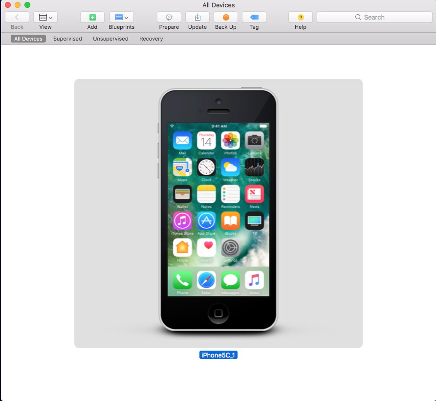
1. Go through the device set-up flow and connect it to your network
    * (optional) Set the display to never lock (Settings -> Display)
1. Enable Web Inspector on the device (Settings -> Safari -> Advanced -> Web Inspector)

## Install the software
1. Clone the project code to the Mac (you will need to build it with an Apple developer account certificate).
    * ```git clone https://github.com/WPO-Foundation/iWptBrowser.git```
1. Open the project in XCode
1. Select the attached device as the debugging target
    * 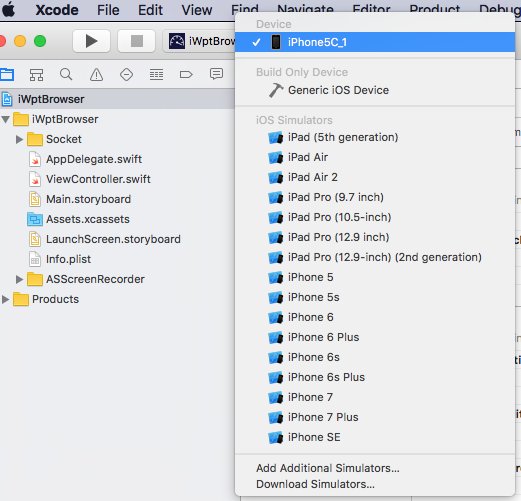
1. Click the play button to build the app, install it on the device and launch it
    * This will also register the device to your developer account which is necessary for testing
1. Assuming the app built correctly and launched on the device, chick the stop button to stop the app
1. Create an Archive build for installing on the device (only need to do this once, the built .ipa can be used for all devices)
    1. Product -> Archive
        * 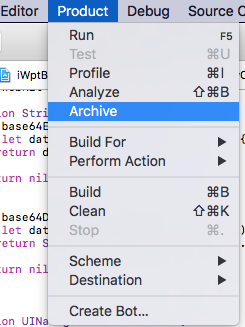
    1. Select the archive that was just created and click the ```Export``` button
        * 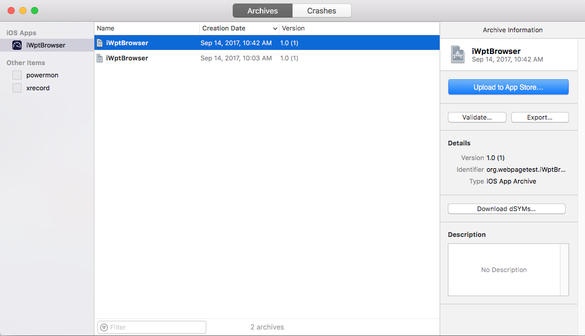
    1. Select to export for ```Development Deployment```
        * 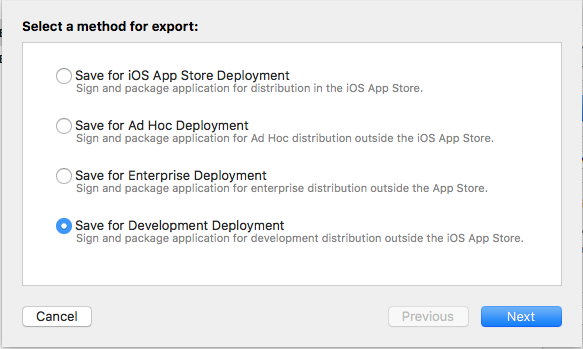
    1. Select your Apple developer account certificate to use for the app (needs to be the same as the device is registered to)
        * 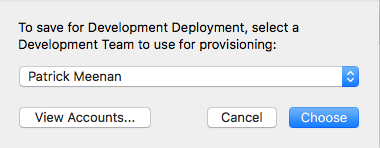
    1. Select to export one app for all devices
        * 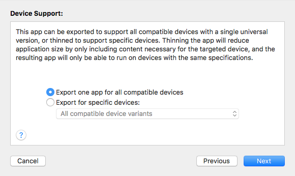
    1. Click ```next``` to run the export process (will take a few minutes)
        * 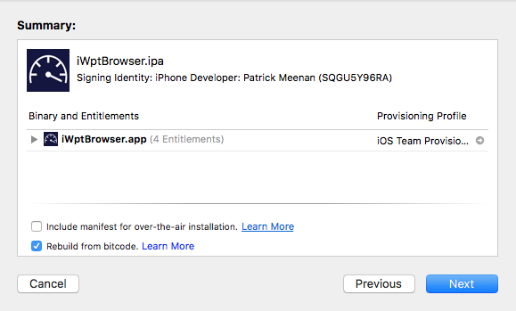
    1. Select a destination folder for the installable .ipa (I usually copy it from a folder to my desktop to make it easy to drag and drop install onto the device)
        * 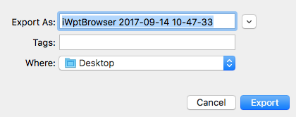
1. Exit XCode
1. Open Apple configurator 2
1. Double-click on the device and select the ```Apps``` view (from the column on the left)
1. Drag-and-drop your iWptBrowser.ipa archive build into the device apps window (and choose to overwrite the existing install)
    * 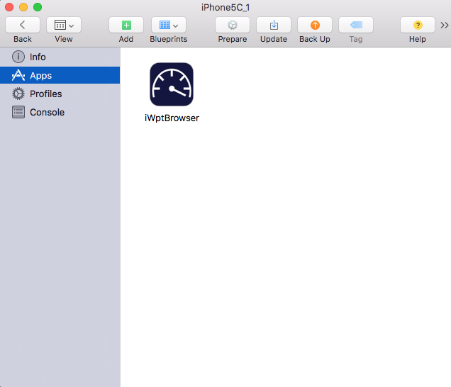

## Test to agent
1. Disconnect the device from the Mac
1. Connect the device to the test machine that will be driving the testing
    * Setup instructions are available [here](https://github.com/WPO-Foundation/wptagent/blob/master/docs/install.md)
    * Using a Raspberry Pi as a controller is highly recommended but any Mac or Linux machine should work (limited to one device per machine currently)
1. Click the "Trust" button on the device if prompted to trust the test machine
1. Start the agent (with the --iOS command-line option to let it know it is running testing on an iOS device)
1. Submit a test to make sure everything is working as expected

## Lock the device into single app mode
Running in single-app mode is optional but it will automatically re-start iWptBrowser if it crashes, runs out of memory or even if the device reboots and is HIGHLY recommended for a test device.
1. After the device has been tested and is set to trust the test computer, reconnect it to the Mac
1. Launch Apple configurator 2
1. Right click on the device and select Advanced -> Start Single App Mode
    * 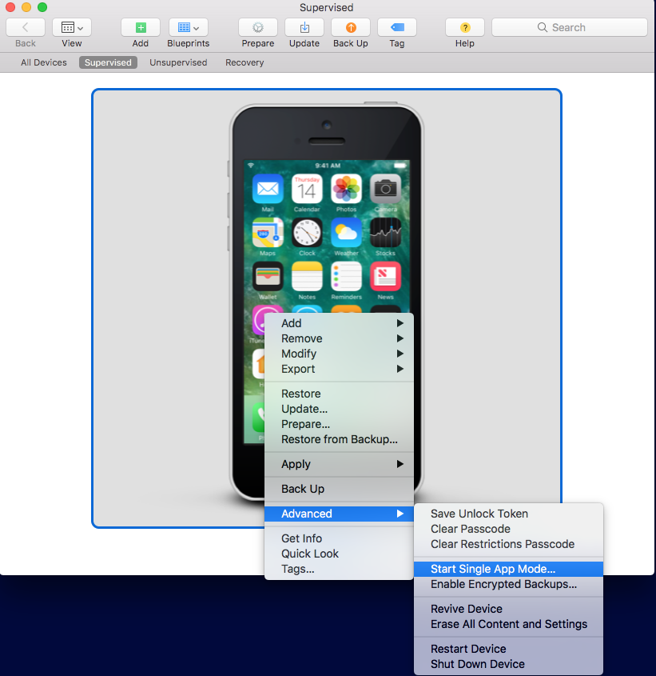
1. Select the iWptBrowser app

## PROFIT! (Congratulations, you are done)
The same process needs to be repeated for each device with the exception of building a new archive.  If the devices are already registered to your developer account then you can also skip the step of running the app from XCode (it's just done since XCode takes care of automatically registering and provisioning the device).